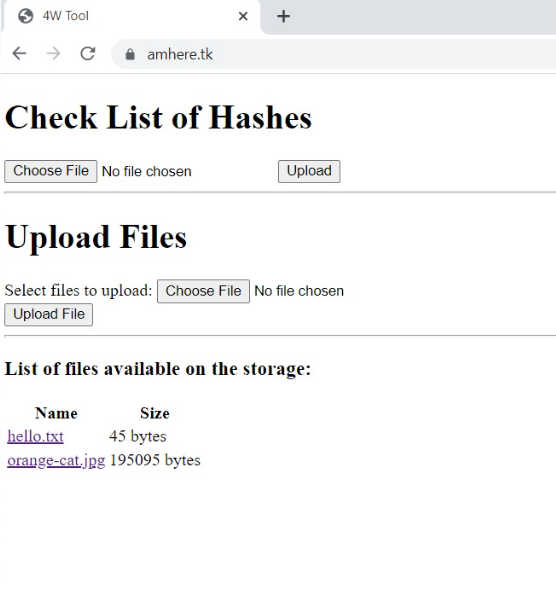
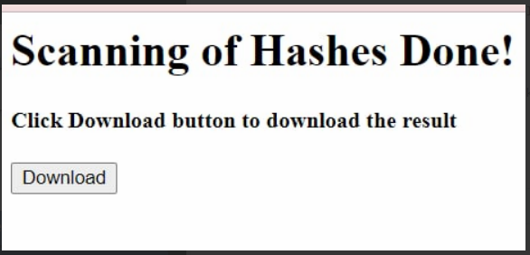

# 4W - File Analysis

## About

4W Tool is a simple and user-friendly webpage where it utilized VirusTotal and ThreatCrowd to collect useful information from a list of hashes. 

### Feautres:

- Analyze a list of hashes

- Download result of the scan

- Upload files

- Download files

- Serve files via http

---

## Install & Config
Ensure this are installed:

	pip install flask-cloudy
	pip install fasteners

In the "TO-RUN" directory install the few requirements needed:

	python -m pip install -r requirements.txt
	python -m pip install -r requirements2.txt

---

## How to Run

The main file to run is in the "TO-RUN" directory named 'app.py'. Access the directory and run:

	python app.py
  
### Sample Data

There is some sample data in the "sampledata" directory. The hashes were chosen at random and are not intended 
to be directed at any specific organization or individual. The following is how this tool works with the sample data:

Upload 'smallerlist.txt' or 'largerlist.txt' to the Check List of Hashes form. It will scan through with VirusTotal and 
ThreatCrowd and create an excel with the result. In the download page, click on Download to download the result of scan:

